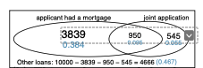

### EJEMPLO **3.1** 

Un "dado", el singular de dados, es un cubo con seis caras numeradas 1, 2, 3, 4, 5 y 6. ¿Cuál es la probabilidad de obtener 1 al lanzar un dado?

Si el dado es justo, la probabilidad de obtener un 1 es tan buena como la probabilidad de obtener cualquier otro número. Dado que hay seis resultados, la probabilidad debe ser de 1 entre 6, o, equivalentemente, 1/6.

### **EJEMPLO 3.2** 

¿Cuál es la probabilidad de obtener un 1 o un 2 en la siguiente tirada? 1 y 2 constituyen dos de los seis resultados posibles igualmente probables, por lo que la probabilidad de obtener uno de estos dos resultados es 2/6 = 1/3.

### **EJEMPLO 3.3**

 ¿Cuál es la probabilidad de obtener un 1, 2, 3, 4, 5 o 6 en la siguiente tirada?

100%. El resultado debe ser uno de estos números.

### **EJEMPLO 3.4** 

¿Cuál es la probabilidad de no sacar un 2?

Dado que la probabilidad de sacar un 2 es 1/6 o 16.6%, la probabilidad de no sacar un 2 debe ser 100% - 16.6% = 83.3% o 5/6. Alternativamente, podríamos haber notado que no sacar un 2 es lo mismo que sacar un 1, 3, 4, 5 o 6, lo que suma cinco de los seis resultados igualmente probables y tiene una probabilidad de 5/6.

### **EJEMPLO 3.5** 

Considera lanzar dos dados. Si 1/6 de las veces el primer dado es un 1 y 1/6 de las veces el segundo dado también es un 1, entonces la probabilidad de que ambos dados sean un 1 es (1/6)×(1/6) o 1/36.

### PRÁCTICA GUIADA 3.6

Los procesos aleatorios incluyen lanzar un dado y lanzar una moneda. (a) Piensa en otro proceso aleatorio. (b) Describe todos los posibles resultados de ese proceso. Por ejemplo, lanzar un dado es un proceso aleatorio con posibles resultados 1, 2, ..., 6.

Lo que consideramos procesos aleatorios no son necesariamente aleatorios, pero pueden ser demasiado difíciles de entender exactamente. El cuarto ejemplo en la solución de la nota al pie de la Práctica Guiada 3.6 sugiere que el comportamiento de un compañero de piso es un proceso aleatorio. Sin embargo, incluso si el comportamiento de un compañero de piso no es verdaderamente aleatorio, modelar su comportamiento como un proceso aleatorio puede seguir siendo útil.

### PRÁCTICA GUIADA 3.7

Estamos interesados en la probabilidad de sacar un 1, 4 o 5.

\(a\) Explica por qué los resultados 1, 4 y 5 son disjuntos.

\(b\) Aplica la Regla de la Adición para resultados disjuntos para determinar $P(1 \: o \: 4 \: o \: 5)$.

#### Respuesta

\(a\) El proceso aleatorio es un lanzamiento de dado, y como máximo uno de estos resultados puede aparecer. Esto significa que son resultados disjuntos. $P(1 \: o \: 4 \: o \: 5) =P(1)+P(4)+P(5)=1/6​+1/6​+1/6​=3/6​=1/2​$

### PRÁCTICA GUIADA 3.8

En el conjunto de datos de **préstamos** la variable de propiedad de vivienda describía si el prestatario alquila, tiene una hipoteca o es dueño de su propiedad. De los 10,000 prestatarios, 3858 alquilaban, 4789 tenían una hipoteca y 1353 eran dueños de su casa.

\(a\) ¿Son los resultados "alquilar", "hipoteca" y "ser dueño" disjuntos?

\(b\) Determina la proporción de préstamos con valor "hipoteca" y "ser dueño" por separado.

\(c\) Usa la Regla de la Adición para resultados disjuntos para calcular la probabilidad de que un préstamo seleccionado aleatoriamente del conjunto de datos sea para alguien que tiene una hipoteca o es dueño de su casa.

#### Respuesta

\(a\) Sí. Cada préstamo se clasifica en un solo nivel de propiedad de la vivienda.

\(b\) Hipoteca: 4789/10000​=0.479. Propiedad: 1353/10000​=0.135.

(c) $P(hipoteca\: o\: propiedad) = P(hipoteca)+P(propiedad)=0.479+0.135=0.614$.

### PRÁCTICA GUIADA 3.9

\(a\) Verifica que la probabilidad del evento A, P(A), es 1/3 usando la Regla de la Adición.

\(b\) Haz lo mismo para el evento B.

#### Respuesta

(a) P(A)=P(1 o 2)=P(1)+P(2)=1/6​+1/6​=2/6​=1/3​.

\(b\) De manera similar, P(B)=1/3.

### PRÁCTICA GUIADA 3.10

\(a\) Usando la como referencia, ¿qué resultados están representados por el evento D?

\(b\) ¿Son los eventos B y D disjuntos?

\(c\) ¿Son los eventos A y D disjuntos?

{fig-align="center"}

#### Respuesta

\(a\) Resultados 2 y 3.

\(b\) Sí, los eventos B y D son disjuntos porque no comparten resultados.

\(c\) Los eventos A y D comparten un resultado en común, 2, y por lo tanto no son disjuntos. \${}\^{6}\$Dado que B y D son eventos disjuntos, usa la Regla de la Adición: P(B o D)=P(B)+P(D)=1/3+1/3​=2/3​.

### PRÁCTICA GUIADA 3.13

\(a\) Si A y B son disjuntos, describe por qué esto implica que P(A y B)=0.

\(b\) Usando la parte (a), verifica que la Regla General de la Adición se simplifica a la Regla de Adición más simple para eventos disjuntos si A y B son disjuntos.

#### Respuesta

\(a\) Si A y B son disjuntos, A y B no pueden ocurrir simultáneamente. (b) Si A y B son disjuntos, entonces el último término P(A y B) en la fórmula de la Regla General de la Adición es 0 (ver parte (a)) y nos quedamos con la Regla de la Adición para eventos disjuntos.

### PRÁCTICA GUIADA 3.14

En el conjunto de datos de *préstamos* que describe 10,000 préstamos,

1495 préstamos fueron de solicitudes conjuntas\\

(p. ej., una pareja solicitó junta),

4789 solicitantes tenían una hipoteca y 950 tenían ambas características.

Crea un diagrama de Venn para esta configuración.

#### Respuesta

{fig-align="center"}

Se muestran tanto los recuentos como las probabilidades correspondientes (por ejemplo, 3839/10000=0.384).

Ten en cuenta que el número de préstamos representados en el círculo izquierdo corresponde a 3839+950=4789,

y el número representado en el círculo derecho es 950+545=1495.

### PRÁCTICA GUIADA 3.15

\(a\) Usa tu diagrama de Venn de la Práctica Guiada 3.14 para determinar la probabilidad de que un préstamo

extraído aleatoriamente del conjunto de datos de *préstamos* sea de una solicitud conjunta donde

la pareja tenía una hipoteca.

(b) ¿Cuál es la probabilidad de que el préstamo tuviera cualquiera de estos atributos?

#### Respuesta

\(a\) La solución está representada por la intersección de los dos círculos: 0.095.

\(b\) Esta es la suma de las tres probabilidades disjuntas que se muestran en los círculos: 0.384+0.095+0.055=0.534 (difiere en 0.001 debido a un error de redondeo).
