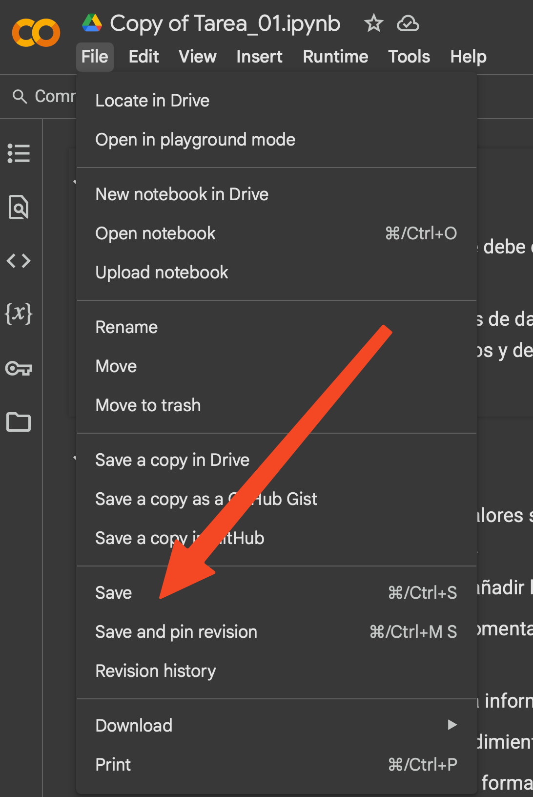
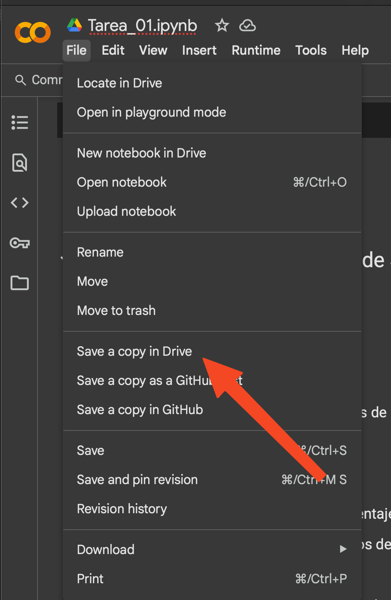
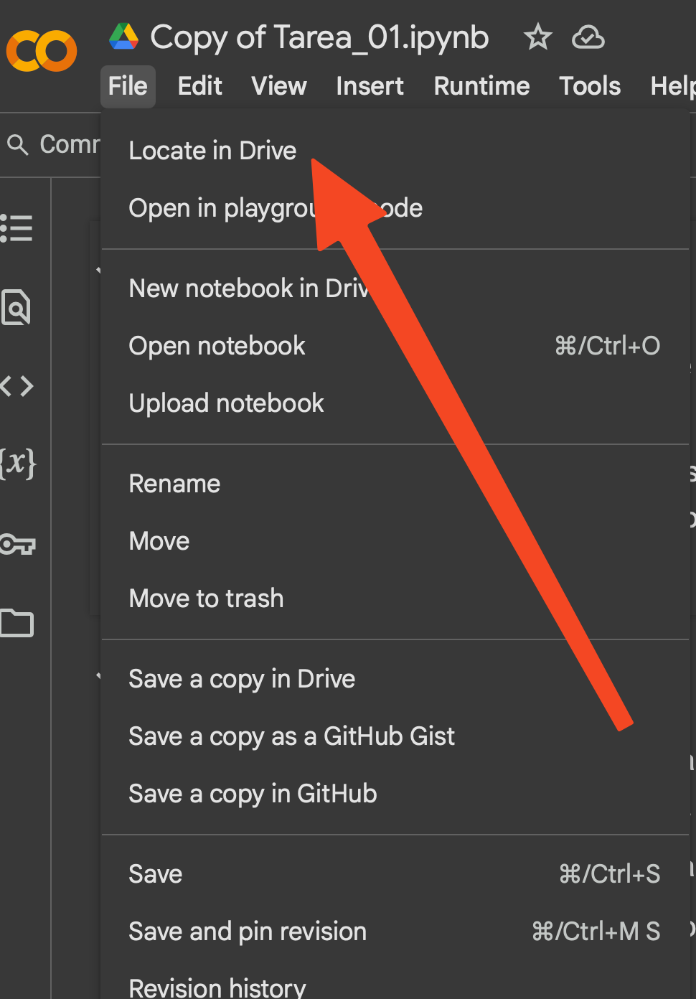
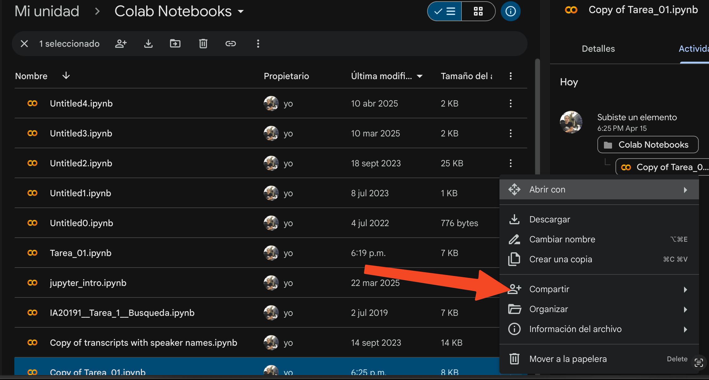
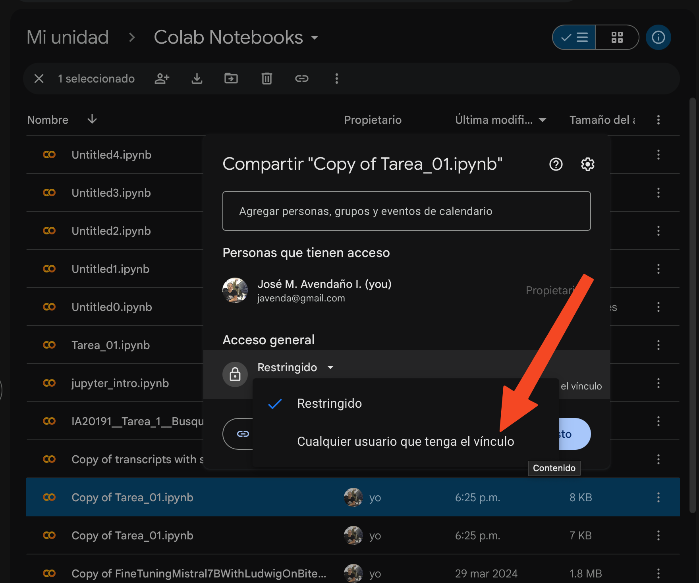
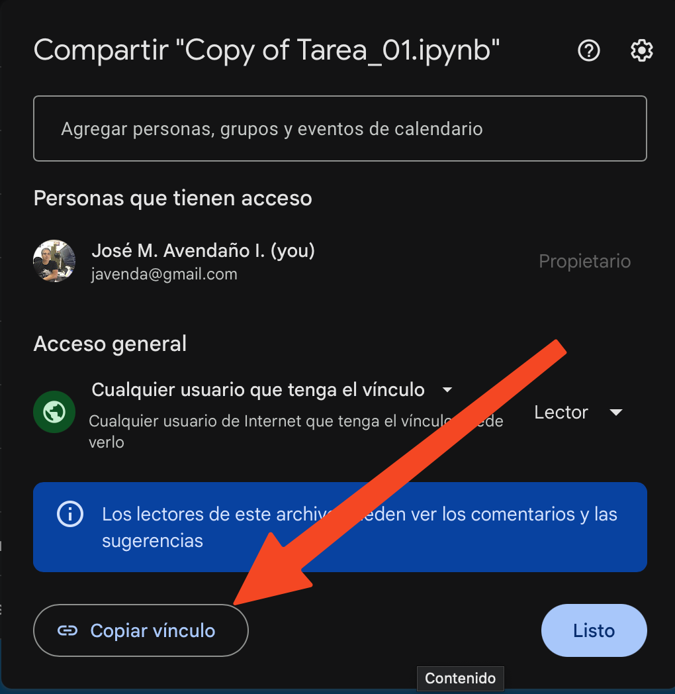

## Tarea Evaluada

-   El enlace a la tarea es el siguiente: <https://colab.research.google.com/github/javendaXgh/ucveconomiar4ds-2025-1/blob/main/notebooks/Tarea_01.ipynb>

-   Esta tarea debe ser entregada antes de la medianoche de 27 de abril de 2028

-   Para entregar la tarea el procedimiento es el siguiente:

    -   Una vez que tenga completado todos los códigos y respuestas escritas, guardar el archivo:

        {width="300"}

    -   Usar en la barra de herramientas "file/Save a copy in drive"

        {width="300"}

    -   Ubicar el archivo en su google drive: "file/locate in drive"

        {width="300"}

    -   Ubicar el nombre del archivo, en este caso "tarea 1" y luego presionar los tres puntos que aparecen en el extremo derecho el área "compartir"

        {width="300"}

    -   Seleccionar la opción "cualquiera que tenga el vínculo"

        {width="300"}

    -   Al aparecer esta pestaña, presionar, y luego "copiar vínculo"

        {width="300"}

    -   Remitir vínculo por correo electrónico a javenda\@gmail.com con el asunto: tarea 01, su nombre, su ci. Nota: No debe compartir el link con otros miembros del curso.
